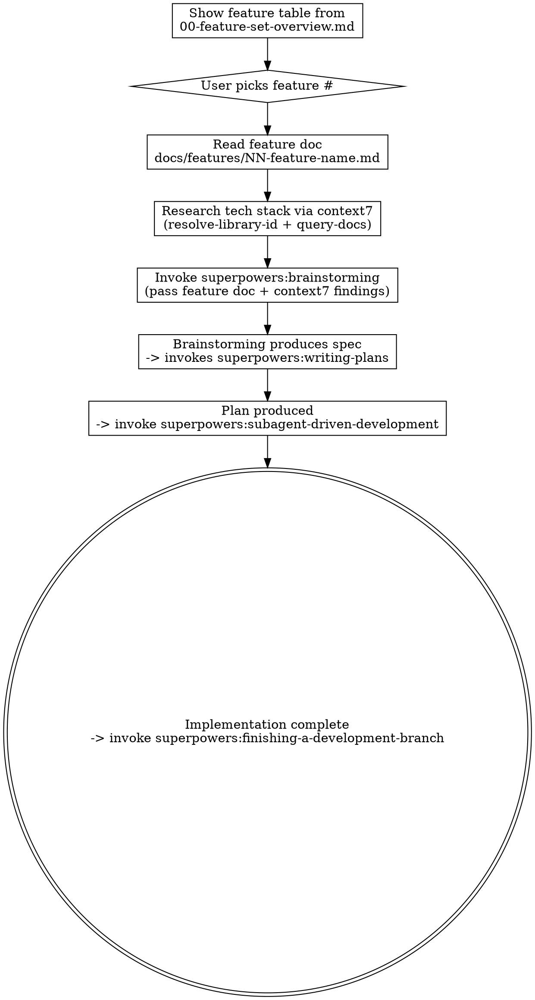

# Implement Feature

Pick a feature from the GraphMesh feature set, research the tech with context7, then implement it end-to-end using superpowers.

## Process

## Step 1: Feature Selection

Read `docs/features/00-feature-set-overview.md` and present the feature table to the user. Show phase, number, name, dependencies, and effort. Let the user pick by number.

If the user already specified a feature number or name, skip the selection.

## Step 2: Read Feature Doc

Read the full feature doc at `docs/features/NN-feature-name.md`. Extract:
- Problem and goal
- Architecture and data models
- Service interfaces and implementations
- GraphQL schema changes
- Affected files
- Acceptance criteria
- Dependencies on other features

Check which dependencies are already implemented by scanning the codebase (look for existing classes, interfaces, services mentioned in the dependency list).

## Step 3: Context7 Research

Based on the feature's tech requirements, query context7 for current documentation:

1. **Identify libraries** the feature uses (from feature doc + project tech stack)
2. **Resolve library IDs** via `mcp__plugin_context7_context7__resolve-library-id`
3. **Query relevant docs** via `mcp__plugin_context7_context7__query-docs`

Common libraries to check per feature type:

| Feature Type | Libraries to Research |
|---|---|
| Storage (Cassandra, Qdrant, S3) | Spring Data Cassandra, Qdrant Java Client, AWS S3 SDK |
| LLM/AI | Spring AI (ChatClient, structured output, embeddings) |
| GraphQL API | Spring Boot GraphQL (@QueryMapping, coroutines) |
| Kafka messaging | Spring Kafka |
| Frontend | Next.js, React |

Also check: Koog framework (the project's LLM abstraction) if the feature involves LLM calls.

Summarize findings concisely — focus on API patterns, Kotlin-specific considerations, and anything that differs from what the feature doc assumes.

## Step 4: Brainstorming

**REQUIRED SUB-SKILL:** Invoke `superpowers:brainstorming`

Provide the brainstorming skill with:
- The full feature doc content
- Context7 research findings (relevant API patterns, gotchas)
- Current codebase state (what's already implemented vs. missing)
- Any discrepancies between feature doc and actual code (e.g., package names, framework choices)

The brainstorming skill handles: clarifying questions, approach proposals, design presentation, spec writing, and handoff to writing-plans.

## Step 5: Planning

The brainstorming skill invokes `superpowers:writing-plans` automatically.

## Step 6: Implementation

After the plan is written, offer execution choice:
- **Subagent-Driven (recommended):** `superpowers:subagent-driven-development`
- **Inline:** `superpowers:executing-plans`

## Step 7: Completion

**REQUIRED SUB-SKILL:** Invoke `superpowers:finishing-a-development-branch`

## Key Rules

- **Always use context7** before brainstorming — don't rely on training data for library APIs
- **Check existing code** before assuming something needs to be built from scratch
- **Follow existing patterns** — the project uses Koog (not Spring AI ChatClient) for LLM calls, `runBlocking` for coroutines, standalone parsing logic copies in tests
- **Package is `com.agentwork.graphmesh`**, not `com.graphmesh` as feature docs sometimes say
- **No Testcontainers** — use docker-compose for integration tests
- **No submodules** — flat Spring Modulith package structure
